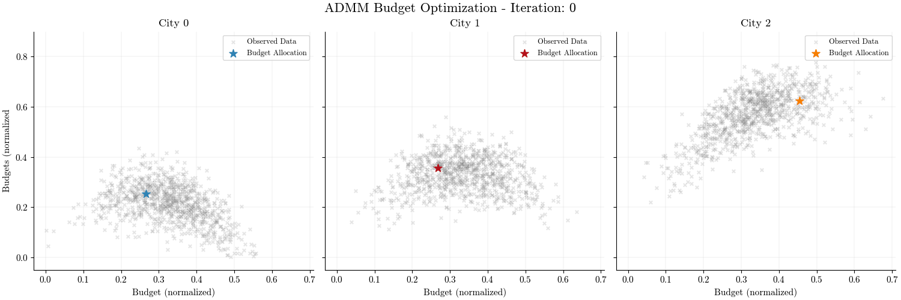

+++
title = "Reproducing Uber's Marketplace Optimization"
date = 2025-09-15
author = "Gabriel Stechschulte"
categories = ["optimization", "jax"]
ShowToc = true
TocOpen = false
draft = false
math = true
+++

Uber allocates money across different regions and programs to incentivize riders and drivers to use Uber products. This incentive structure ultimately influences the market. This leads to the natural question of "how much to allocate to each city and which program" to maximize business objectives? Uber has a finite amount of money that must be allocated accordingly. Given a total budget of say, $1,000,000, how should it be divied up amongst the cities and programs?

Uber has developed an automated system for answering such a question. In this post, I will be reproducing the paper [Practical Marketplace Optimization at Uber Using Causally-Informed Machine Learning](https://arxiv.org/abs/2407.19078) in JAX on a simulated marketplace dataset. The main objective of this post is to: (1) develop a neural network that learns the association between budget allocations and marketplace outcomes, and (2) implement the Alternating Direction Method of Multipliers (ADMM) algorithm in the context of resource allocation problems using the neural network.

## Data simulation

In order to better understand how the neural network is embedded into ADMM and how ADMM works, a simple marketplace dataset with three cities and one program for each city is simulated. To maintain some of the real-life characteristics of the data, non-linearity and interaction effects are introduced. This results in the following graphs


Depending on the total budget allocation constraint, a reasonable budget allocation should be approximately $\$2500, $3500, and $5000 for city 0, 1, and 2, respectively.

## Implementation

There are four main methodological components in Uber's automated budget allocation system

1. **User Causal Effect Estimator**. A deep learning (DL) model that uses historical data to predict marketplace outcomes such as gross bookings for each region.
2. **Smoothing Layer**. Used to generate a differentiable low-dimensional response surface from the DL model outputs in order to more efficiently perform optimization.
3. **Optimizer**. Computes the optimal budget allocation for each region and lever subject to the marketplace model dynamics and business operation constraints.
4. **Business Value Evaluation**. An evaluation framework to measure the quality of the optimal budget allocations.

In this post, we will discuss components 1-3 and implement the DL model and ADMM algorithm.

### User Causal Effect Estimator

For the user causal effect estimator, I implement a simple neural network with an embedding layer for the "sparse" categorical features (cities) and a linear layer for the "dense" numerical features (budgets). The sparse and dense feature embeddings are then concatenated and fed through a series of ResNet blocks. However, for simplicity, I use MLPs.

```python
class MarketModel(nnx.Module):
    def __init__(
        self,
        num_cities: int,
        city_embedding_dim: int,
        budget_embedding_dim: int,
        *,
        rngs: nnx.Rngs,
    ):
        input_dim = city_embedding_dim + budget_embedding_dim

        # Sparse embedding layer (for categorical features)
        self.city_embedding = nnx.Embed(
            num_embeddings=num_cities, features=city_embedding_dim, rngs=rngs
        )
        # Dense feature extractor (for numerical features)
        self.budget_embedding = nnx.Linear(1, budget_embedding_dim, rngs=rngs)

        self.linear1 = nnx.Linear(input_dim, 128, rngs=rngs)
        self.linear2 = nnx.Linear(128, 256, rngs=rngs)
        self.linear3 = nnx.Linear(256, 128, rngs=rngs)
        self.linear4 = nnx.Linear(128, 16, rngs=rngs)

        self.out = nnx.Linear(16, 1, rngs=rngs)

    def __call__(self, city_idx: Array, budget: Array) -> Array:
        budget_embedding = nnx.relu(self.budget_embedding(budget))
        city_embedding = self.city_embedding(city_idx)

        # Sparse and dense feature embeddings are concatenated
        combined_input = jnp.concatenate([city_embedding, budget_embedding], axis=-1)

        x = nnx.relu(self.linear1(combined_input))
        x = nnx.relu(self.linear2(x))
        x = nnx.relu(self.linear3(x))
        x = nnx.relu(self.linear4(x))
        x = self.out(x)

        return x
```

The input to the `MarketModel` is an array of city indices and budgets. Training the model and plotting the model's predictions results in the following graph below. This simple neural network architecture is able to learn the association between per-city budget allocations and business outcomes (gross bookings) reasonably well.


This model will then be embedded into the optimizer where we will differentiate and evaluate the response surface of the model. Repeatedly evaluating the response surface is like asking "what happens if we increase driver incentives by 100 dollars in Chicago while decreasing rider promotions by 50 dollars in Detriot"? Then, when we taken the gradient of the outcome (bookings) with respect to the input (budgets), we get a sense of which direction maximizes our objective.

### Smoothing model

The deep learning (DL) model produces a mapping from budgets to marketplace outcomes (supply, demand, gross bookings, etc.), which can be fed into an optimizer. However, the optimization routine require numerous passes over the response surface, necessitating many evaluations of the DL model, which is computationally costly. The response surface can be thought of a non-convex landscape where each point represents a different combination of budget amounts across various levers and cities where the height at each point shows the predicted business outcome.

The goal with the smoothing model is to generate a low-dimensional "smooth" differential surface for derivative-based optimization algorithms. Uber achieves this using Adaptive Sparse Grids (ASG) to strategically sample a grid-based representation of the DL surface. B-spline functions are then used as a smoothing model to approximate the response surface. B-splines are choosen because of their flexibility and analytical derivative forms. This B-spline model is then embeded into the ADMM algorithm to provide low-cost evaluations of the response surface.

As I simulate a dataset where I can visually see the optimal budget allocations for each city, I will not implement the smoothing model in this post. Instead, I will embed the DL model directly into the ADMM algorithm. Although, once more levers are added to each city or more features are added to the DL model, it would be interesting to analyze the impacts the smoothing model has on the ADMM results.


### Optimizer

ADMM is used to solve the non-linear, non-convex resource allocation problem. The objective is to break up a total budget into smaller budgets for each city and program. This allows us to separate the single-city cross-lever problem and the cross-city problem and solve both problems iteratively. The objective function to solve is

$$
\begin{aligned}
\min_{\mathbf{b}, \mathbf{z}} \quad & \sum_{c \in \text{cities}} f_c(\mathbf{b}_c) + g(\mathbf{z}) \\\\
\text{s.t.} \quad & \mathbf{b}_c - \mathbf{z}_c = \mathbf{0}, \quad \forall c \in \text{cities}
\end{aligned}
$$

and the ADMM algorithm consists of three steps:

* $\mathbf{b}$ **update**. This step optimizes each city independently given the current consensus $\mathbf{z}$ and duals $\mathbf{y}$ effectively balancing the primary objective (maximize the outcome for *this* city), consensus penalty (stay close to the consensus target allocation), and the business penalty (don't stray too far from the reference budget allocation).

$$
\begin{aligned}
\mathbf{b}_c^{k+1} := \underset{\mathbf{b}_c}{\operatorname{argmin}} \left( f_c(\mathbf{b}_c) + \frac{\rho}{2} \left\lVert \mathbf{b}_c - \mathbf{z}^k + \mathbf{y}_c^k \right\rVert_2^2 \right) \\\\
\end{aligned}
$$

* $\mathbf{z}$ **update**. Coordinates across all cities to satisfy the global (total) budget constraint and computes the consensus allocation closest to the city preferences $\mathbf{b}_c^{k+1} + \mathbf{y}_c^k$. (*Note*: The summation term sums over all cities. Hugo is being a pain and won't compile a summation with multiple subscripts)

$$
\begin{aligned}
\mathbf{z}_c^{k+1} := \underset{\mathbf{z}}{\operatorname{argmin}} \left( g(\mathbf{z}) + \frac{\rho}{2} \sum_c \left\lVert \mathbf{b}_c^{k+1} - \mathbf{z}_c + \mathbf{y}_c^k \right\rVert_2^2 \right)  \\\\
\end{aligned}
$$

* $\mathbf{y}$ **update**. Accumulates constraint violations between city budget and the consensus allocation.

$$
\begin{aligned}
\mathbf{y}_c^{k+1} := \mathbf{y}_c^{k} + \mathbf{b}_c^{k+1} - \mathbf{z}_c^{k+1}
\end{aligned}
$$

where $\rho$ is a penalty for total budget constraint violations. This parameter controls the tradeoff between how many gross bookings we are willing to sacrifice to reduce the total budget constraint violation. Small $\rho$ typically results in loose constraints and takes the ADMM algorithm longer to converge, and vice-versa. Uber also introduces another penalty term in the form of Hellinger distance that forces the algorithm to prefer allocations similar to a reference budget allocation. Instead of the Hellinger distance, I implement a simple quadratic penalty term scaled by $\phi$.

In primal-dual optimization methods, the dual variables, also known as Lagrange multipliers, provide valuable insights into the marginal effect of constraints on the objective function. These variables represent the shadow price of a given constraint, such as a city's budget, quantifying how much the total objective would improve if that budget were increased by one unit.

One of the reasons for the popularity of ADMM is that the $\mathbf{b}$ update step can be implemented in parallel. Although this step uses variables from the previous iteration, within this step, all the per-city problems can be optimized in parallel. JAX primitives lends itself well to a high-performance implementation of ADMM. We can easily perform the per-city update in parallel with `vmap`, use `lax.scan` for loops with state, and `jit` for computation heavy functions.

With that being said, the implementation is fairly straightforward. The ADMM algorithm is implemented via `ADMMAlgorithm` and is stateless. It takes `state` and a `step` function and then operates on this `state`. For each `step`, the algorithm outputs a new `state`. We can then run the algorithm for $n$ steps and accumulate the results. Moreover, the `step` function is JIT compiled so the XLA compiler traces and optimizes all the function therein.

```python
def z_update(budgets: Array, duals: Array, total_budget: float) -> Array:
    n_cities = len(budgets)
    u_k = budgets + duals
    adjustment = (total_budget - jnp.sum(u_k)) / n_cities
    consensus = adjustment + u_k
    return consensus


def y_update(budgets: Array, consensus: Array, duals: Array) -> Array:
    return duals + budgets - consensus


def city_objective(model_fn: Callable) -> Callable:
    def objective(
        budget: float,
        city: int,
        consensus: float,
        dual: float,
        reference: float,
        rho: float,
        phi: float,
    ):
        outcome = model_fn(jnp.array([city]), jnp.array([[budget]])).squeeze()
        admm_penalty = rho / 2 * (budget - consensus + dual) ** 2
        business_penalty = phi * (budget - reference) ** 2
        return -outcome + admm_penalty + business_penalty

    return objective


def b_update(
    objective_fn: Callable,
    min_budget: float,
    max_budget: float,
    lr: float,
    n_steps: int,
) -> Callable:
    optimizer = optax.adam(learning_rate=lr)

    def update(
        city: int,
        budget: float,
        consensus: float,
        dual: float,
        reference: float,
        rho: float,
        phi: float,
    ):
        def obj_fn(x):
            return objective_fn(x, city, consensus, dual, reference, rho, phi)

        def scan_fn(carry, _):
            budget_val, opt_state_val = carry
            # Compute gradient w.r.t this budget
            loss_val, grad_val = jax.value_and_grad(obj_fn)(budget_val)
            # Update and apply
            updates, new_opt_state = optimizer.update(
                grad_val, opt_state_val, budget_val
            )
            new_budget_unconstrained = optax.apply_updates(budget_val, updates)
            # Projection
            projected_budget = optax.projections.projection_box(
                new_budget_unconstrained, min_budget, max_budget
            )
            return (projected_budget, new_opt_state), loss_val

        current_budget = budget
        opt_state = optimizer.init(budget)

        (final_budget, _), losses = jax.lax.scan(
            scan_fn, (current_budget, opt_state), None, length=n_steps
        )
        return final_budget

    return update


def build_admm(model_fn: Callable, config: ADMMConfig) -> ADMMAlgorithm:
    city_obj = city_objective(model_fn)
    b_update_ = b_update(
        city_obj, config.min_budget, config.max_budget, config.lr, config.n_optim_steps
    )
    b_update_vmap = jax.vmap(
        b_update_,
        in_axes=(0, 0, 0, 0, 0, None, None),  # Vectorize over cities
    )

    def init_fn(initial_budgets: Array) -> ADMMState:
        return ADMMState(
            budgets=initial_budgets,
            consensus=initial_budgets,
            duals=jnp.zeros(config.n_cities),
        )

    def step_fn(state: ADMMState) -> Tuple[ADMMState, ADMMInfo]:
        # Vectorized per-city budget updates
        city_indices = jnp.arange(config.n_cities)
        new_budgets = b_update_vmap(
            city_indices,
            state.budgets,
            state.consensus,
            state.duals,
            config.reference_budget,
            config.rho,
            config.phi,
        )
        new_consensus = z_update(new_budgets, state.duals, config.total_budget)
        new_duals = y_update(new_budgets, new_consensus, state.duals)

        # Updated state
        new_state = ADMMState(
            budgets=new_budgets, consensus=new_consensus, duals=new_duals
        )

        new_objective = jnp.sum(jax.vmap(model_fn)(city_indices, new_budgets[:, None]))
        primal_residual = jnp.linalg.norm(new_budgets - new_consensus)
        dual_residual = jnp.abs(jnp.sum(new_budgets) - config.total_budget)

        # Updated info
        new_info = ADMMInfo(
            objective=new_objective,
            primal_residual=primal_residual,
            dual_residual=dual_residual,
            converged=primal_residual < config.tol,
        )

        return new_state, new_info

    return ADMMAlgorithm(init_fn, step_fn)
```

## Results

The ADMM algorithm is initialized as follows

```python
# Budget constraints scaled by the maximum allowed budget
total_budget = 15000.0 / max_budget
min_budget_per_city = 3000.0 / max_budget
max_budget_per_city = 8000.0 / max_budget
tolerance = 50 / max_budget

# Initial and reference budgets scaled by the maximum allowed budget
init_budgets = jnp.array([1000.0, 1000.0, 1000.0]) / max_budget
ref_budgets = jnp.array([5000.0, 5000.0, 5000.0]) / max_budget

config = ADMMConfig(
    n_cities=n_cities,
    total_budget=total_budget,
    reference_budget=ref_budgets,
    rho=0.25,
    phi=0.001,
    lr=0.01,
    tol=tolerance,
    min_budget=min_budget_per_city,
    max_budget=max_budget_per_city,
    n_optim_steps=50,
)

admm = build_admm(model, config)
```

and the algorithm is ran for $n$ steps (or until convergence).

```python
@partial(jax.jit, static_argnames=["algorithm", "n_steps"])
def run(algorithm, initial_state, n_steps):
    def scan_fn(state, _):
        new_state, info = algorithm.step(state)
        return new_state, (info, new_state.budgets)

    final_state, (trace, budget_trace) = jax.lax.scan(
        scan_fn, initial_state, None, length=n_steps
    )

    return final_state, trace, budget_trace

state = admm.init(init_budgets)
# Warmup JIT compilation
_ = run(admm, state, 10)
jax.block_until_ready(_)

start = time.time()
final_state, trace, budget_trace = run(admm, state, 10)
jax.block_until_ready((final_state, trace, budget_trace))
duration = time.time() - start
```
```bash
Running ADMM optimization
==============================
Completed in            : 0.0248 sec.
Final budgets           : [3964.27   4028.075  8000.0005]
Final objective         : 186.1875
Final primal residual   : 0.038195
Final dual residual     : 0.066156
Budget sum              : 15992.35 (target: 15000.0)
```
Running the algorithm for 10 iterations results in 186 gross bookings with allocations of `[3964, 4028, 8000]` for city 0, 1 and 2, and go over budget by almost $1,000. Visualizing the budget allocations over the ADMM iterations shows that the algorithm initially (iterations 1-3) explores different regions of the response surface for each city and then quickly identifies a near-optimal budget allocation for each city that maximizes the total gross bookings.



When performing non-convex optimization with methods such as ADMM, we do not have theoretical guarantees that the optimization algorithm has converged to an optimal solution. However, we can analyze various variables and or metrics to assess convergence and the quality of the solution. For ADMM, we will analyze the dual and primal residuals as well as the objective function (gross bookings) over the ADMM iterations.

At a high-level, the dual residual measures the consensus allocation stability, i.e., "is the algorithm converging on a consensus allocation?", whereas the primal residual measures the original constraint violation, i.e., "how much are we violating the total budget constraint?". The calculation for the primal and dual residuals are computed as follows

```python
# Magnitude of consensus constraint violation
primal_residual = jnp.abs(jnp.sum(new_budgets) - config.total_budget)
# Magnitude of consensus variable variation
dual_residual = config.rho * jnp.linalg.norm(new_consensus - state.consensus)
```

and plot the results


The amount of gross bookings is expected to increase and then flat line. In the paper, the authors state that they look for "small" changes in the objective value from the previous ADMM iteration.

The dual variables for each city's budget are expected to converge to a single common value. This convergence signifies an optimal allocation where the marginal return per dollar is equalized across all cities. For instance, if one city's dual variable were higher than another's it would indicate a higher marginal return for one city over another signaling that more budget should be allocated there.

<!--Once converged, this common dual value has a direct physical interpretation; if, for example, the dual value is 0.273, increasing the total budget by $150 would increase total gross bookings by approximately 0.273 * 150 = 41 bookings.-->

The primal residuals, measuring how much we are violating the total budget constraint, should be "small" and exhibit stability over the ADMM iterations.

## Conclusion

With the simplified dataset and neural network, it appears that the ADMM implementation is computing the optimal budget allocations per-city. The implementation herein is vastly simplified compared to the system outlined by the authors. It would be interesting to add another lever dimension to each city to see the results from the ADMM algorithm.

Moreover, Uber uses Adaptive Sparse Grids (ASG) to learn a low-dimensional representation of the response surface generated by the DL model. A B-spline model is then used to generate a differentiable "smooth" response surface which is then embedded into the ADMM routine instead of the neural network directly. As more dimensions are added, it would also be interesting to analyze the impact of such methods on the optimization result.
