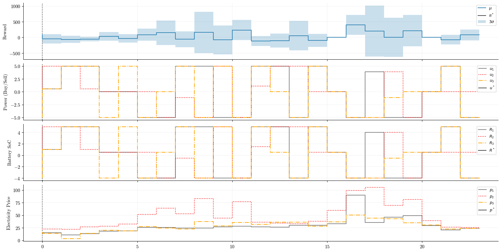
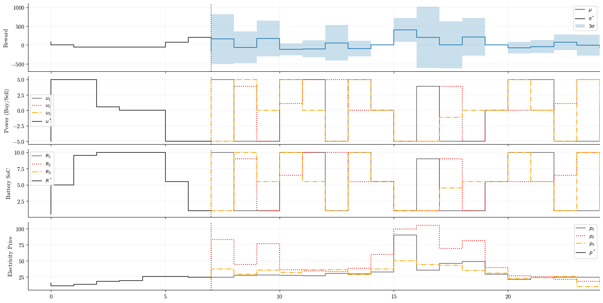
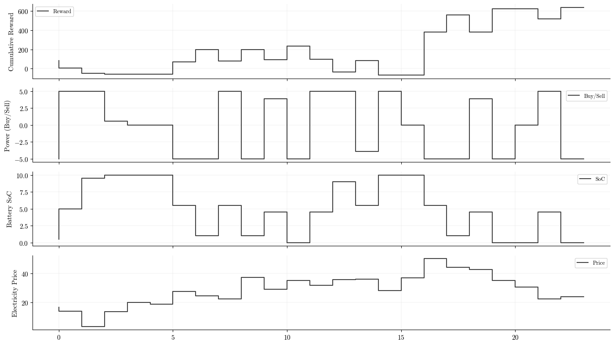

+++
title = "Stochastic Model Predictive Control"
date = 2025-11-18
author = "Gabriel Stechschulte"
categories = ["optimization", "jax", "probabilistic-programming"]
ShowToc = true
TocOpen = false
draft = false
math = true
+++

Many applications of optimization and control are performed in a deterministic setting. That is, the quantities of the problem such as the state variables, control variables, and or parameters of a model are treated as fixed known values. This assumption may be reasonable in applications such as robotics, but in others such as resource allocation, we may need to incorporate the uncertainty of various quantities in order to compute the **expectation** of the objective.

For example, when performing battery arbitrage, the goal is to develop a system that uses a battery to buy energy from the grid when prices are low and sell back to the grid when prices are high. Electricity prices can fluctuate greatly due to supply and demand. Thus, our system needs to take into account the uncertainty of the electricity prices. Optimizing **and** taking uncertainty into account means that we seek an optimal solution that accounts for different outcomes of the data.

For example, in the bottom subplot at 12:00, we face different price scenarios for the remainder of the day. Each price scenario can result in a differerent optimal decision (second to top plot) which impacts the reward (top plot) and consequently the battery state of charge (SoC).


Stochastic optimization essentially boils down to putting expectations in front of things and or computing probabilities and then solving the optimization problem. Most basic stochastic optimization problems, like the one above, can be solved via strategies that either: compute expectations directly, or by methods that approximate them.

In this post, we will develop a model predictive control (MPC) framework utilizing sampled approximations to solve the battery arbitrage problem described above. To simplify the problem setup, to generate the samples, a set of price paths will be sampled from the historical data and we will act like these samples are the price forecasts from the posterior predictive distribution of a Bayesian model.

The code to reproduce the results of this post can be found in the following [GitHub repository](https://github.com/GStechschulte/seq-opt-jax).

## Model predictive control

MPC is a flexible control framework that uses a model of a system to predict its future behavior and optimize control actions over a time horizon. At each time step, an MPC controller solves an optimization problem to find the best sequence of control actions that minimizes a cost function while satisfying system constraints. In MPC, only the first control action from the control trajectory is implemented, and the process is repeated at the next time step allowing the controller to adapt to new information.

## Problem formulation

The objective is to develop a MPC controller that maximizes the **expected profit** by choosing how much energy to buy from or sell to the grid $e$ given the electricity price $p$ at each timestep $t$ over some horizon $T$.


$$
\begin{equation}
\max_{u} \mathbb{E} \sum_{t=0}^T -p_t e_t
\end{equation}
$$

The decision variables (controls) are subject to the following constraints

$$
\begin{align}
e_t &\leq \frac{1}{\eta} (R^{\max} - R_t) \\\\
e_t &\geq -\frac{1}{\eta} R_t
\end{align}
$$

where $R$ is the battery SoC at each time step $t$. So far, the system is comprised of the following state vector $\mathbf{x}$ and control vector $\mathbf{u}$


$$
\begin{align}
\mathbf{x} = (R_t, p_t) \\\\
\mathbf{u} = (e_t)
\end{align}
$$

The variables in the state vector evolve according to the following transition functions

$$
\begin{align}
R_{t+1} = R_t + \eta x_t \\\\
p_{t+1} = f(p_t)
\end{align}
$$

where $f$ is a Bayesian model that forecasts the electricity price over the horizon $T$.

### Sample average approximation

Our objective function (1) involves an expectation over uncertain price forecasts. Rather than computing the expectation analytically, we can use sample average approximation (SAA) by drawing $N$ samples from the posterior predictive distribution obtained from a Bayesian model. Let $c_n$ represent the $n$'th sample from the posterior predictive distribution. The SAA of equation (1) becomes

$$
\begin{align}
\min_{x, x_{n=1}^N} \frac{1}{N} \sum_{n=1}^N c_n^T  x_n
\end{align}
$$

where $x_n \in \mathbb{R}^H$ is the control trajectory for price sample $n$ and $c_n \in \mathbb{R}^H$ is the price forecast trajectory for price sample $n$. Since the SAA problem is embeded into the MPC framework, this problem is solved at each timestep 

$$
\begin{align}
\min_{x, x_{n=1}^N} \frac{1}{N} \sum_{n=1}^N \sum_{h=0}^{H-1}  c_h^n  x_h^n
\end{align}
$$

where $x_h^n$ is the $n$'th control trajectory at the $h$'th hour and $c_h^n$ is the $n$'th price forecast at the $h$'th hour. In practice (and shown in the implementation below), we will stack the control vector into $\bar{x}$ to obtain a single large LP. Then, when you take the dot product between $c$ and $x$, you effectively compute the **expected profit**.

$$
\begin{align}
\min_{x} \bar{c}^T \bar{x} \\\\
\text{s.t.} \space A_{ub} \bar{x} \leq b_{ub} \\\\
A_{eq} \bar{x} = b_{eq} \\\\
l \leq \bar{x} \leq u
\end{align}
$$

### Constraints

Constraints are one of those things that are easy to state in words, but can be tricky when it comes to implementing them in code. The constraints of our problem quickly become complex as we are optimizing over scenarios (samples) and time (the control horizon). Here, we introduce and use triangular and block diagonal matrices to encode the constraints of our system.

In our MPC problem we need to ensure the following at each timestep
1. The battery SoC cannot exceed its minimum or maximum capacity.
2. The amount of power bought from the grid cannot cause the battery SoC to go above its maximum capacity.
3. The amount of power sold to the grid cannot cause the battery SoC to go below its minimum capacity.
4. For each scenario (sample), the first decision (control) must be equal to each other.

Recall the standard LP formulation

$$
\begin{align}
\min_{x} c^Tx \\\\
\text{s.t.} \space A_{ub} x \leq b_{ub} \\\\
A_{eq} x = b_{eq} \\\\
l \leq x \leq u
\end{align}
$$

where $x$ is a control vector, $c$ is a coefficient vector, $A_{ub}$ encodes inequality constraints, $A_{eq}$ encodes equality constraints, and $\ell$ and $u$ encode lower and upper bounds (box constraints) on controls.


Constraint (1) is the easiest. These are the box constraints $\alpha$ of $R_t$ and are traditionally passed to the SciPy `linprog` function as a list of tuples

```python
bounds = [(-alpha, alpha) for _ in range(n_vars)]
```

Constraints (2) and (3) are more complex. We need to translate the decision variable constraints from above to matrix-form $A_{ub} x \leq b_{ub}$. First, lets imagine we only have one sample. Reformulate the constraint equations above to 

$$
\begin{align}
e_t &\leq \frac{1}{\eta} (R^{\max} - R_t) &\rightarrow \eta e_t \leq R^{max} - R_t \\\\
e_t &\geq -\frac{1}{\eta} R_t &\rightarrow -\eta e_t \leq R_t
\end{align}
$$

Notice how the left hand side terms $\eta$ can be expressed as a matrix of coefficients and the right hand side terms can be expressed in terms of a column vector. 

At each time step, we solve the LP for the next 24 hours subject to these "upper" and "lower" constraints on the decision variables. The optimizer evaluates the constraints via the dot product `A_ub @ x <= b_ub`. To enforce the respective constraints on each decision variable $u_0, u_1, \ldots, u_N$ at each timestep we use a lower triangular matrix for each upper and lower constraint of shape `(24, 24)`.

```python
upper_constraint = np.tri(H, H) * eta
lower_constraint = np.tri(H, H) * (-eta)
```

which would give us the following upper constraint in matrix-form

$$
\begin{bmatrix}
\eta & 0 & 0 & \ldots & 0 \\\\
\eta & \eta & 0 & \ldots & 0 \\\\
\eta & \eta & \eta & \ldots & 0 \\\\
\vdots & \vdots & \vdots & \ddots & \vdots \\\\
\eta & \eta & \eta & \ldots & \eta \\\\
\end{bmatrix}
\begin{bmatrix}
x_0 \\\\
x_1 \\\\
x_2 \\\\
\vdots \\\\
x_{H-1} \\\\
\end{bmatrix}
\leq
\begin{bmatrix}
R^{max} - R_t \\\\
R^{max} - R_t \\\\
R^{max} - R_t \\\\
\vdots \\\\
R^{max} - R_t \\\\
\end{bmatrix}
$$

and the lower constraint

$$
\begin{bmatrix}
-\eta & 0 & 0 & \ldots & 0 \\\\
-\eta & -\eta & 0 & \ldots & 0 \\\\
-\eta & -\eta & -\eta & \ldots & 0 \\\\
\vdots & \vdots & \vdots & \ddots & \vdots \\\\
-\eta & -\eta & -\eta & \ldots & -\eta \\\\
\end{bmatrix}
\begin{bmatrix}
x_0 \\\\
x_1 \\\\
x_2 \\\\
\vdots \\\\
x_{H-1} \\\\
\end{bmatrix}
\leq
\begin{bmatrix}
R_t \\\\
R_t \\\\
R_t \\\\
\vdots \\\\
R_t \\\\
\end{bmatrix}
$$

If we only had a single sample we could just vertically stack these two matrices and we would have the final $A_{ub}$ matrix. However, since each sample needs to satsify these upper and lower constraints, we can use a block diagonal matrix to encode this behavior. A block diagonal matrix is a square matrix where the diagonal entries are themselves square matrices (blocks) and all other off-diagonal entries are zero matrices. For example, if there were four posterior samples the upper constraint block diagonal matrix is

$$
\begin{bmatrix}
A_{ub_1} & 0 & 0 & 0 \\\\
0 & A_{ub_2} & 0 & 0 \\\\
0 & 0 & A_{ub_3} & 0 \\\\
0 & 0 & 0 & A_{ub_4}
\end{bmatrix}
$$

where there are four diagonal matrices; one for each sample. Each diagonal matrix is an `upper_constraint` matrix. The structure for the lower constraint block diagonal matrix it the same. We use `scipy.linalg.block_diag` to build the block matrices. Lastly, these two block matrices are vertically stacked to obtain the final $A_{ub}$ matrix.

```python
# Repeat upper/lower constraints for each sample
upper_blocks = [upper_constraint.copy() for _ in range(n_samples)]
lower_blocks = [lower_constraint.copy() for _ in range(n_samples)]

# Each diagonal block contains the constraints for this sample
A_ub_upper = scipy.linalg.block_diag(*upper_blocks)
A_ub_lower = scipy.linalg.block_diag(*lower_blocks)
A_ub = np.vstack([A_ub_upper, A_ub_lower])
```

The $b_{ub}$ column vector is where the inequality constraint evaluations happen. We just need to concatenate the evaluation for the upper and lower constraints.

```python
b_ub = np.concatenate([
    np.full(n_samples * H, R_max - R_current),  # Upper constraint eval
    np.full(n_samples * H, R_current)           # Lower constraint eval
])
```

Lastly, constraint (4) encodes non-anticipativity constraints which is a fancy name for saying that "the first control of each sample must be equal to each other". This constraint is primarily required to ensure that the optimal solution is implementable in practice. Without this constraint, the optimal solution may contain different values for the first control sequence in each posterior predictive sample sparking the question—"which control should I implement?".

Non-anticipativity constraints can be encoded using equality constraints. Below, we encode arithmetic that the difference between the first control value for each sample must be zero, i.e., the control values are the same.

```python
for i in range(n_na_constraints):
    # Constraint: u^i_0 - u^{i+1}_0 = 0
    # Position of u^{i+1}_0 in the stacked vector: (i+1) * H + 0
    A_eq_na[i, i * H] = 1.0          # Coefficient for u^i_0
    A_eq_na[i, (i + 1) * H] = -1.0   # Coefficient for u^{i+1}_0

b_eq_na = np.zeros(n_na_constraints)
```

## Implementation

The full sample average approximation implementation is the following

```python
def solve_saa(R_current, p_forecast_samples):
    n_samples, H, dim = p_forecast_samples.shape

    n_vars = n_samples * H

    # Coefficient vector is the forecasted prices
    # Now in terms of the expected profit
    c = (1 / n_samples) * p_forecast_samples.flatten()

    upper_constraint = np.tri(H, H) * eta
    lower_constraint = np.tri(H, H) * (-eta)

    upper_blocks = [upper_constraint.copy() for _ in range(n_samples)]
    lower_blocks = [lower_constraint.copy() for _ in range(n_samples)]

    # Each diagonal block contains the constraints for this sample
    A_ub_upper = scipy.linalg.block_diag(*upper_blocks)
    A_ub_lower = scipy.linalg.block_diag(*lower_blocks)
    A_ub = np.vstack([A_ub_upper, A_ub_lower])

    b_ub = np.concatenate([
        np.full(n_samples * H, R_max - R_current), # Upper constraint eval
        np.full(n_samples * H, R_current) # Lower constraint eval
    ])
    bounds = [(-alpha, alpha) for _ in range(n_vars)]

    # Build non-anticipativity constraints
    n_na_constraints = n_samples - 1 
    A_eq_na = np.zeros((n_na_constraints, n_vars))

    for i in range(n_na_constraints):
        # Constraint: u^i_0 - u^{i+1}_0 = 0
        # Position of u^i_0 in the stacked vector: i * H + 0
        # Position of u^{i+1}_0 in the stacked vector: (i+1) * H + 0
        A_eq_na[i, i * H] = 1.0          # Coefficient for u^i_0
        A_eq_na[i, (i + 1) * H] = -1.0   # Coefficient for u^{i+1}_0

    b_eq_na = np.zeros(n_na_constraints)

    res = linprog(
        c=c,
        A_ub=A_ub,
        b_ub=b_ub,
        A_eq=A_eq_na,
        b_eq=b_eq_na,
        bounds=bounds,
        method="highs"
    )

    return res
```

Running the MPC controller over the control horizon, we can visualize the trajectories over time.

```python
# System parameters
T = 48
H = 24
n_states = 2
n_controls = 1
R_max = 10
alpha = 5
eta = 0.9

# Trajectories
x_traj = np.zeros((H, n_states))
u_traj = np.zeros((H, n_controls))
obj_traj = np.zeros((H,))

# Initial conditions
R_current = 5.0
actual_p_idx = 0 # Realized price scenario
p_current = p_sampled[actual_p_idx, 0].item()
total_obj = 0.0
future_xs = range(H)

for k in range(H):
    current_xs = range(k)

    # Get price forecast
    p_forecast = p_sampled[:, k: H + k]

    # Solve the sample average approx. problem
    out = solve_saa(R_current, p_forecast)
    profit = -out.fun
    u_opt = out.x

    # Apply first control sequence
    uk_opt = u_opt[0]

    # Compute contribution
    obj = objective(uk_opt, p_current)

    # State transition
    R_current = R_current + (eta * uk_opt)
    p_current = p_sampled[actual_p_idx, k + 1].item()

    # Compute cumulative reward
    total_obj += obj

    # Track trajectories
    x_traj[k] = np.array([R_current, p_current])
    u_traj[k] = np.array([uk_opt])
    obj_traj[k] = total_obj

    # Propogate uncertainty
    u_opt_all = u_opt.reshape(4, 24, 1)
    obj_all = objective(u_opt_all, p_forecast)
    meanobj = obj_all.mean(axis=0).flatten()
    stdobj = obj_all.std(axis=0).flatten()
    r_current_all = R_current + (eta * u_opt_all)
    
    # Plotting code not shown here...
```

It is interesting to observe the uncertainty of the reward (profit) given the samples for the decision and state variables. For example, we can observe that when the controls are all the same, e.g., from timestep 15:00 to 16:00, the reward uncertainty is very small. Whereas in the time period from 16:00 to 20:00, prices and control decisions are more uncertain, and thus the uncertainty in the reward is much higher. The realized trajectory (indicated by the solid black line following the dashed vertical line) shows that the reward roughly followed the expected reward and that the solver chooses controls that maximize the expected reward.








