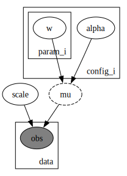

<!--eofm-->

Hierarchical regression, also known as multilevel modeling, is a powerful modeling technique that allows one to analyze data with a nested structure. This approach is particularly useful when dealing with data that has natural groupings, such as students within schools, patients within hospitals, or in the example below, product configurations within manufacturing processes. One of the key advantages of hierarchical regression lies in its ability to handle missing data in groups, i.e., when one group may not share the same covariates as another group or some groups may contain missong observations.

## Simulated Example: Manufacturing Process Analysis

To illustrate the ability of hierarchical regression in handling missing data, let's consider a simulated example from a manufacturing context. We'll analyze how different machine process parameters impact production speed across two product groups. In this simulation, we generate data for two product groups with different dependencies on machine process parameters:

- Product group 1 depends on feed speed and pull acceleration.
- Product group 2 depends on feed speed, pull acceleration, and cutting wait time.

The cutting wait time for product group  1 is set to NaN, simulating a scenario where this parameter is not applicable or not measured for this group.

```python
import matplotlib.pyplot as plt
import numpy as np
import numpyro
import pandas as pd
import seaborn as sns
import jax.numpy as jnp
import numpyro.distributions as dist

from jax import random
from numpyro.infer import Predictive
```


```python
n_samples = 500

# Generate machine process parameters for both groups
feed_speed = np.random.uniform(1, 10, n_samples)
pull_acceleration = np.random.uniform(0.5, 5, n_samples)
cutting_wait_time = np.random.uniform(0.1, 2, n_samples)

# Create product groups
product_group = np.array(['Product_Group_1'] * (n_samples // 2) + ['Product_Group_2'] * (n_samples // 2))

# Calculate production speed
production_speed = np.zeros(n_samples)

# Product Group 1: depends on feed speed and pull acceleration (Cutting Wait Time is NaN)
mask_pg1 = product_group == 'Product_Group_1'

# Increased coefficients for Product Group 1 to ensure higher production speed
production_speed[mask_pg1] = (feed_speed[mask_pg1] * 2.5 +
                              pull_acceleration[mask_pg1] * 3 +
                              np.random.normal(0, 0.5, sum(mask_pg1)))

# Product Group 2: depends on all three parameters
mask_pg2 = product_group == 'Product_Group_2'
production_speed[mask_pg2] = (feed_speed[mask_pg2] * 1 +
                              pull_acceleration[mask_pg2] * 0.5 +
                              cutting_wait_time[mask_pg2] * 3 +
                              np.random.normal(0, 0.5, sum(mask_pg2)))

# Create DataFrame with NaN for Cutting Wait Time in Product Group 1
simulated_dataset = pd.DataFrame({
    'Product_Group': product_group,
    'Feed_Speed': feed_speed,
    'Pull_Acceleration': pull_acceleration,
    'Cutting_Wait_Time': [np.nan if x == 'Product_Group_1' else cutting_wait_time[i] for i,x in enumerate(product_group)],
    'Production_Speed': production_speed
})
```


```python
plt.figure(figsize=(7, 3))
sns.histplot(
    data=simulated_dataset,
    x="Production_Speed",
    hue="Product_Group",
    binwidth=1
)
plt.xlabel("Production Speed")
plt.title("Simulated Data Distribution");
```


```python
# sns.pairplot(simulated_dataset.iloc[:, 0:], hue="Product_Group", corner=True);
```


```python
simulated_dataset["Product_Group"] = (simulated_dataset["Product_Group"]
                                      .map({
                                          "Product_Group_1": 0,
                                          "Product_Group_2": 1
                                          })
                                    )
```

## Parameter Masking for Missing Data

To handle the missing data in our hierarchical model, I will use a technique called *parameter masking*. This approach allows us to effectively "turn off" certain parameters for specific groups where they are not applicable when data `X` is passed to the model. Key aspects of this approach:

1. We use an `indicators` array to specify which parameters are relevant for each product group.
2. The input data `X` is masked to replace NaNs with zeros, and then multiplied by the indicators.
3. The weights `w` are also masked using the indicators, ensuring that irrelevant parameters don't contribute to the predictions.

```python
parameter_mask = jnp.array([
    [1, 1, 0],
    [1, 1, 1]
])
config_idx = jnp.array(simulated_dataset["Product_Group"].values)
X = jnp.array(simulated_dataset.iloc[:, 1:4].values)
y = jnp.array(simulated_dataset["Production_Speed"].values)
```


```python
def model(indicators, config_idx, X, y=None):
    n_configs, n_params = indicators.shape

    # Create a masked version of X where NaNs are treated as zeros based on the indicators
    X_masked = jnp.where(jnp.isnan(X), 0.0, X) * indicators[config_idx]

    # Group-specific effects
    with numpyro.plate("config_i", n_configs):
        alpha = numpyro.sample("alpha", dist.Normal(0., 5.))
        with numpyro.plate("param_i", n_params):
            w = numpyro.sample("w", dist.Normal(0., 5.))

    # Compute the weighted sum of features using indicators to zero-out unused parameters
    w_masked = jnp.multiply(w.T, indicators)

    eq = alpha[config_idx] + jnp.sum(jnp.multiply(X_masked, w_masked[config_idx]), axis=-1)
    mu = numpyro.deterministic("mu", eq)
    scale = numpyro.sample("scale", dist.HalfNormal(5.))

    with numpyro.plate("data", X.shape[0]):
        numpyro.sample("obs", dist.Normal(mu, scale), obs=y)
```


```python
numpyro.render_model(
    model,
    model_args=(
        parameter_mask,
        config_idx,
        X,
        y
    ),
    render_params=True
)
```





```python
rng_key = random.PRNGKey(seed=42)
rng_key, rng_subkey = random.split(key=rng_key)

kernel = numpyro.infer.NUTS(model)

mcmc = numpyro.infer.MCMC(
    kernel,
    num_warmup=200,
    num_samples=300,
    num_chains=4,
    chain_method="vectorized"
)

mcmc.run(
    rng_subkey,
    parameter_mask,
    config_idx,
    X,
    y
)
```

    sample: 100%|██████████| 500/500 [00:03<00:00, 148.27it/s]


## Model Inference and Results

After running MCMC inference on our model, we can examine the parameter estimates and make predictions.


```python
# Parameter estimates for w[2, 0] are actually 0.0 once data is passed
# through the program
mcmc.print_summary()
```


                    mean       std    median      5.0%     95.0%     n_eff     r_hat
      alpha[0]     -0.03      0.11     -0.04     -0.20      0.15    598.37      1.00
      alpha[1]      0.05      0.12      0.05     -0.18      0.22    797.79      1.01
         scale      0.52      0.02      0.52      0.50      0.55   1058.94      1.00
        w[0,0]      2.51      0.01      2.51      2.49      2.53    837.47      1.00
        w[0,1]      1.00      0.01      1.00      0.98      1.02   1350.56      1.00
        w[1,0]      2.98      0.02      2.98      2.94      3.02    740.98      1.00
        w[1,1]      0.49      0.03      0.49      0.45      0.53   1002.80      1.00
        w[2,0]      0.11      5.30     -0.03     -7.42      9.98    893.63      1.00
        w[2,1]      3.05      0.07      3.05      2.93      3.15    891.06      1.01

    Number of divergences: 0


This summary shows us the estimated parameters, including group-specific intercepts (alpha) and weights for each parameter. Importantly, we'll see that the weight for the third parameter (cutting wait time) in Product group 1 is effectively zero as expected. We can now use the model to make predictions.


```python
rng_key, rng_subkey = random.split(key=rng_key)

samples = mcmc.get_samples()

predictive = Predictive(model, posterior_samples=samples)
pps = predictive(
    rng_subkey,
    parameter_mask,
    config_idx,
    X,
    None
)
```


```python
simulated_dataset["preds"] = pps["obs"].mean(axis=0)

plt.figure(figsize=(7, 3))
sns.histplot(data=simulated_dataset, x="Production_Speed", binwidth=1, label="obs")
sns.histplot(data=simulated_dataset, x="preds", binwidth=1, label="pps")
plt.xlabel("Production Speed")
plt.title("Posterior Predictive Distribution");
```


This plot compares the observed production speeds with the model's predictions, allowing us to assess how well our model captures the underlying patterns in the data.


```python
config_idx_new = jnp.array([0, 1], dtype=jnp.int32)

X_test = jnp.array([
    [3.0, 2.0, 0.0],
    [3.0, 2.0, 2.0]
])

rng_key, rng_subkey = random.split(key=rng_key)
pps_new = predictive(
    rng_subkey,
    parameter_mask,
    config_idx_new,
    X_test,
    None
)

pps_new["obs"].mean(axis=0)
```


    Array([13.455311, 10.143251], dtype=float32)


```python
config_idx_new = jnp.array([0, 1], dtype=jnp.int32)

X_test = jnp.array([
    [6.0, 2.0, 2.0],
    [6.0, 2.0, 2.0]
])

rng_key, rng_subkey = random.split(key=rng_key)
pps_new = predictive(
    rng_subkey,
    parameter_mask,
    config_idx_new,
    X_test,
    None
)

pps_new["obs"].mean(axis=0)
```


    Array([20.98238 , 13.135274], dtype=float32)


## Conclusion

Hierarchical regression, combined with parameter masking, provides a powerful framework for analyzing grouped data with missing values. This approach allows us to:

1. Account for group-specific variations in the relationships between predictors and outcomes.
2. Handle missing data without requiring imputation or discarding incomplete cases.
3. Make predictions for new data, even when some predictors are not applicable to certain groups.
